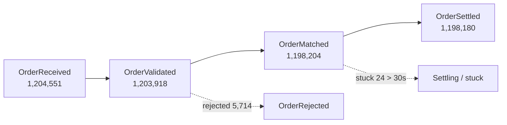
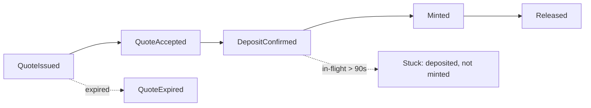

# Business Events as the Next Observability Plane

> An interview talking point that extends the Canton-on-Dash0 demo forward.
> Traditional observability answers "is the system healthy" with metrics, logs, and
> traces, and Dash0 adds AI on top of those three signals. This document argues for a
> fourth, first-class signal — the **business event** — keyed by domain identity
> rather than request lineage, correlated with the traditional stack but with its own
> lifecycle, funnel, and conversion views. At the scale of a trading order book or a
> cross-chain bridge quote stream, this is where observability actually earns its keep.

---

## Contents

- [1. The one-sentence pitch](#1-the-one-sentence-pitch)
- [2. What a business event is (and is not)](#2-what-a-business-event-is-and-is-not)
- [3. Why the log wall fails at scale](#3-why-the-log-wall-fails-at-scale)
- [4. Grounding in OpenTelemetry today](#4-grounding-in-opentelemetry-today)
- [5. What Dash0 can productize on top](#5-what-dash0-can-productize-on-top)
- [6. Worked example: trading order book](#6-worked-example-trading-order-book)
- [7. Worked example: cross-chain bridge](#7-worked-example-cross-chain-bridge)
- [8. Why this is grounded in the Canton demo](#8-why-this-is-grounded-in-the-canton-demo)
- [9. How I would build it on the existing pipeline](#9-how-i-would-build-it-on-the-existing-pipeline)
- [10. Honest boundaries and risks](#10-honest-boundaries-and-risks)
- [11. How to say it in the interview](#11-how-to-say-it-in-the-interview)

---

## 1. The one-sentence pitch

[↑ Back to Contents](#contents)

**Metrics, logs, and traces tell you whether the system is healthy; business events
tell you whether the business is working — and at millions of orders or quotes, the
business event is the signal you should navigate from first, with the traditional
stack as the drill-down underneath it.**

Everything below expands that sentence: what the signal is, why the other three are
not enough on their own, that OpenTelemetry already carries it, and how Dash0 turns it
into a product surface rather than another place to dump structured logs.

---

## 2. What a business event is (and is not)

[↑ Back to Contents](#contents)

### 2.1 The definition to lead with

[↑ Back to Contents](#contents)

A business event is a **named, schematized, domain-meaningful record of something that
happened in the business**, keyed by **business identity** rather than by request
lineage. Concrete names make it unambiguous: `OrderPlaced`, `OrderMatched`,
`QuoteIssued`, `QuoteFilled`, `BridgeDepositConfirmed`, `AppInstallAccepted`. Each
carries a typed payload — the order id, the party, the amount, the venue, the state —
not a sentence of prose that a reader has to parse back into fields.

The keying is the entire point, and it is what separates a business event from the
other three signals. A trace is keyed by `trace_id` and answers "where did this one
request flow." A metric is keyed by label sets over time buckets and answers "what is
the aggregate shape." A log is keyed by nothing in particular and answers "what was
printed at this line." A business event is keyed by a **domain identifier** —
`order_id`, `quote_id`, `transaction_id`, `party_id` — and answers "what happened to
*this specific business object*, across its whole life, regardless of how many
requests, retries, or services touched it."

### 2.2 The two properties nothing else has

[↑ Back to Contents](#contents)

From that keying come two properties that neither metrics nor traces provide.

First, **full dimensionality is preserved**. Unlike a metric, which throws away the
individual to keep the aggregate, a business event lets you drill from "settlement
latency p99 spiked" straight back to the exact orders, their amounts, and their
counterparties. You never have to choose between aggregate and detail up front.

Second, **correlation survives async gaps**. Unlike a trace, whose span parent-child
structure shatters across retries, message queues, and multi-day settlement windows, a
business event is correlated by a stable domain key that every service already agrees
on. A bridge deposit and the mint that follows it ninety seconds and three services
later are the same lifecycle even though no single trace spans them.

### 2.3 What it is not

[↑ Back to Contents](#contents)

It is not "structured logging with better field names." Structured logging is still
keyed by emission site and read line by line; a business event is keyed by domain
object and read as a lifecycle. The difference shows up the moment you ask "show me
every order that reached `matched` but never reached `settled`" — that is a trivial
business-event query and an expensive, fragile log search.

| Signal | Keyed by | Answers | Loses |
|---|---|---|---|
| Metric | label set × time bucket | Aggregate shape over time | The individual |
| Trace | `trace_id` / span tree | Path of one request | Continuity across async gaps and retries |
| Log | emission site | What was printed here | Structure, correlation, aggregation |
| **Business event** | **domain id** (`order_id`, `tx_id`, `party`) | **Lifecycle of one business object** | Nothing structural — it is the full record |

---

## 3. Why the log wall fails at scale

[↑ Back to Contents](#contents)

### 3.1 The scale argument

[↑ Back to Contents](#contents)

The case is strongest where volume is highest: a trading system with millions of
orders in an order book, or a cross-chain bridge with millions of quotes. There the
log volume is `O(events × verbosity × services)`, and the operational question is never
"what did line 4,812,300 say." It is always a business question — which orders are
stuck, which quotes never converted, where in the lifecycle the drop-off is — and the
log wall is the worst possible substrate for answering it.

### 3.2 Why "AI over the log wall" does not fix it

[↑ Back to Contents](#contents)

Adding an LLM to summarize logs does not change the primitive; it just pays to
reconstruct structure that the system already knew at emit time. Asking a model to
re-derive `order.state = matched, latency_to_fill = 4.2s` from free text is lossy — it
can misread — and it is `O(volume)` in tokens, so it gets more expensive exactly as the
system gets busier. You are paying, per token, to rebuild a schema the application
threw away.

Business events invert the economics. The application emits the structure once, at
almost no cost, and both humans and AI query a substrate that is *already* semantic.
This is the Dash0-flattering framing and the one to say out loud: **business events do
not compete with AI observability — they make it cheap and sharp.** Agent0 reasoning
over typed lifecycle state instead of grepping a wall is faster, cheaper, and less
likely to hallucinate, because the hard part — turning text into meaning — was done at
the source.

---

## 4. Grounding in OpenTelemetry today

[↑ Back to Contents](#contents)

### 4.1 The accurate status

[↑ Back to Contents](#contents)

This must be stated precisely, because a Dash0 interviewer knows the OpenTelemetry
data model cold. OpenTelemetry already models **Events as a specialized `LogRecord`
that carries an `event.name` and a structured body**, distinct from free-text logs, and
semantic conventions define named event schemas. A business event is therefore not a
new transport that has to be invented — it is a log record with a well-known name and a
typed payload, riding the same OTLP protocol, the same Collector, and the same
processors that the demo already runs.

### 4.2 Why that makes the idea cheap to reach

[↑ Back to Contents](#contents)

Because the signal already rides the existing pipeline, the gap between "what I built"
and "this pitch" is naming discipline plus a backend that treats named events as
first-class, not a re-platforming. You need three things: applications that emit events
with stable `event.name`s and domain-id attributes, Collector processors that normalize
and enrich them (which the demo already does for Canton JSON logs), and a backend that
indexes them by domain key and renders lifecycles. Two of the three already exist in the
Canton-on-Dash0 project.

---

## 5. What Dash0 can productize on top

[↑ Back to Contents](#contents)

### 5.1 The business-event plane

[↑ Back to Contents](#contents)

The product is a **business-event plane** that sits alongside metrics, logs, and traces
and correlates with them by domain key. The plane is the entry point — the operator
starts from "what is happening to the business" — and the traditional three signals
become the drill-down underneath each event. This inverts the usual flow, where you
start from a dashboard of infrastructure metrics and try to guess your way toward the
business impact.

### 5.2 Three views that a stock LGTM stack does not give you

[↑ Back to Contents](#contents)

| View | What it shows | Why it is new |
|---|---|---|
| **Lifecycle funnel** | `received → validated → matched → settled` with drop-off and stuck-in-flight counts | Neither Grafana panels nor trace search express "objects that entered state A but never reached state B" cheaply |
| **Correlated pivot** | From a funnel anomaly straight into the traces, logs, and metrics for exactly those events, via the `trace_id` the event already carries | Makes the business plane the entry point and the traditional stack the detail — a generalization of the demo's "semantic navigation" idea |
| **Event-native check rules** | SLOs on conversion rate, fill latency, settlement lag — business KPIs as alerts | Stock alerting watches CPU and 5xx; this watches whether the business is converting |

### 5.3 Where it lands in the demo's product-ideas table

[↑ Back to Contents](#contents)

In the presentation's Dash0 product-ideas list, this adds one row: a **business-event
plane** — named-event ingest, domain-key indexing, lifecycle funnels, conversion and
latency check rules, and Agent0 playbooks that reason over typed lifecycle state rather
than raw logs.

---

## 6. Worked example: trading order book

[↑ Back to Contents](#contents)

### 6.1 The events

[↑ Back to Contents](#contents)

An order book emits a small, stable set of named events per order, each keyed by
`order_id` and carrying the fields that matter for the business: `symbol`, `side`,
`quantity`, `price`, `venue`, `party`, and the resulting `state`.

```text
OrderReceived   → OrderValidated → OrderMatched → OrderSettled
                                 ↘ OrderRejected
                                 ↘ OrderCancelled
```

### 6.2 The funnel view

[↑ Back to Contents](#contents)



The value is that the operator reads business health in one panel: 24 orders reached
`matched` but have not settled in 30 seconds, and 5,714 were rejected at validation.
Each number is a live drill-down — click the 24, get exactly those orders, pivot into
their traces and logs. No log search, no dashboard guesswork.

### 6.3 The check rules

[↑ Back to Contents](#contents)

- Fill latency: p99 of `OrderMatched − OrderReceived` above the venue objective.
- Conversion: `OrderSettled / OrderReceived` below a floor over a rolling window.
- Stuck inventory: count of `matched`-but-not-`settled` older than N seconds above zero.

---

## 7. Worked example: cross-chain bridge

[↑ Back to Contents](#contents)

### 7.1 The events

[↑ Back to Contents](#contents)

A bridge emits a lifecycle per transfer, keyed by `transfer_id` and cross-referenced by
`quote_id` and on-chain `tx_hash`, spanning two chains and often minutes of wall time.

```text
QuoteIssued → QuoteAccepted → DepositConfirmed → Minted → Released
                            ↘ QuoteExpired
```

### 7.2 The funnel view

[↑ Back to Contents](#contents)



This is the exact case where traces fail and business events win. The deposit and the
mint that follows it ninety seconds and three services later are one lifecycle, but they
are not one trace. Keyed by `transfer_id`, the "3,412 deposits confirmed, 3,410 minted,
2 stuck > 90s" answer is a single panel; reconstructed from logs or fragmented traces it
is an investigation.

### 7.3 The check rules

[↑ Back to Contents](#contents)

- Stuck-in-flight: `DepositConfirmed` without matching `Minted` older than the bridge SLA.
- Quote conversion: `QuoteAccepted / QuoteIssued`, watched per corridor.
- Settlement lag: distribution of `Released − DepositConfirmed`, alerted on the tail.

---

## 8. Why this is grounded in the Canton demo

[↑ Back to Contents](#contents)

### 8.1 The demo already pivots on domain identity

[↑ Back to Contents](#contents)

This is not a tangent bolted onto the presentation — it is the direction the Canton work
was already pushing. The demo already treats `transaction_id`, `command_id`,
`workflow_id`, and `party_id` as the primary navigation keys, above `trace_id`
(PRESENTATION §5.6 identifiers, §6.6 semantic navigation, §6.7 zone observability). That
is business-event thinking in all but name.

### 8.2 Canton's privacy model forces it

[↑ Back to Contents](#contents)

Canton makes the argument for you. Its need-to-know model means there is no single
global trace across participants, but there *is* a stable ledger `transaction_id` that
every participant agrees on. So the natural correlation key on Canton is already a domain
identifier, not a trace id — which is exactly the business-event model. Trading order
books and bridge quote streams are the same shape at higher volume, so the pitch
generalizes cleanly from the demo to two large, obviously valuable domains.

---

## 9. How I would build it on the existing pipeline

[↑ Back to Contents](#contents)

The build path reuses the demo's architecture and adds naming discipline plus backend
treatment, in three steps.

1. **Emit** — applications produce OpenTelemetry Events (log records with a stable
   `event.name` and typed domain-id attributes) instead of, or alongside, free-text logs
   at the moments that matter to the business.
2. **Normalize at the Collector** — the same processor pattern the demo already uses for
   Canton JSON logs (`transform/enrich_canton_json_logs`) promotes `event.name`,
   attaches the domain key, and enforces cardinality and redaction policy at the edge
   before export.
3. **Index and render in Dash0** — the backend indexes events by domain key, renders
   lifecycle funnels, exposes event-native check rules, and lets Agent0 reason over typed
   lifecycle state. Correlation to traces/logs/metrics rides the `trace_id` and resource
   attributes the events already carry.

Two of these three already exist in the Canton-on-Dash0 project; the new surface is the
backend rendering and the emit-side naming convention.

---

## 10. Honest boundaries and risks

[↑ Back to Contents](#contents)

Stating the limits keeps the pitch credible rather than salesy.

- **Emit-side discipline is required.** Business events are only as good as the naming
  and schema discipline of the teams emitting them; without stable `event.name`s and
  agreed domain keys, you are back to structured logging. This is a governance problem,
  not just a backend feature.
- **Cardinality still bites.** Domain ids are high-cardinality by nature. They belong on
  events and traces, where they are needed for drill-down, and must be kept off metric
  labels — the same rule the demo already argues for parties and contract ids.
- **Not every domain needs it.** The value scales with volume and lifecycle complexity;
  a low-traffic CRUD service gets little from a funnel plane. The pitch should be framed
  as "where it matters" — order books, bridges, payments, settlement — not "everywhere."
- **It is a proposal, not shipped.** I would present this as a product direction that my
  demo points toward, honestly distinct from what I have actually built and verified.

---

## 11. How to say it in the interview

[↑ Back to Contents](#contents)

A tight 60-second delivery, in the order that lands best:

1. **Frame the gap.** "Metrics, logs, and traces tell you the system is healthy. At a
   million orders or quotes, the question is never 'what did this log line say' — it is
   'which orders are stuck, which quotes never converted.' That is a business question,
   and the log wall is the wrong substrate for it, even with AI on top."
2. **Name the signal.** "I would treat the business event as a first-class fourth signal
   — `OrderMatched`, `BridgeDepositConfirmed` — keyed by domain id, not trace id, so it
   survives retries and async gaps that shatter a trace."
3. **Ground it in OTel.** "This is not speculative transport. OpenTelemetry already
   models events as named, structured log records, so it rides the same OTLP path and
   Collector my Canton demo already runs."
4. **Show the Dash0 product.** "The backend surface is a business-event plane: lifecycle
   funnels, conversion and latency check rules, and Agent0 reasoning over typed state
   instead of grep. Business events don't compete with AI observability — they make it
   cheap and sharp."
5. **Tie it to the demo.** "And this is where my Canton work already points — it pivots
   on transaction and party id over trace id, because Canton's privacy model gives you a
   stable ledger id but no global trace. Order books and bridges are the same shape at
   higher volume."
