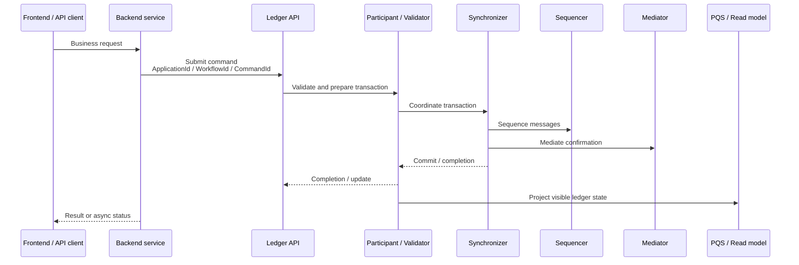
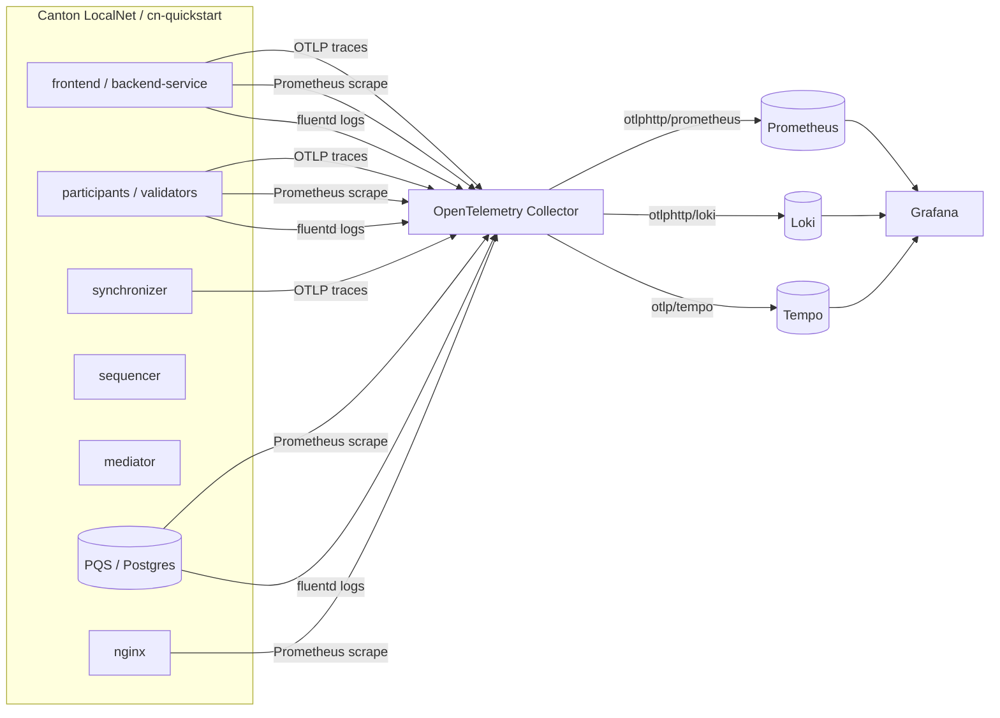
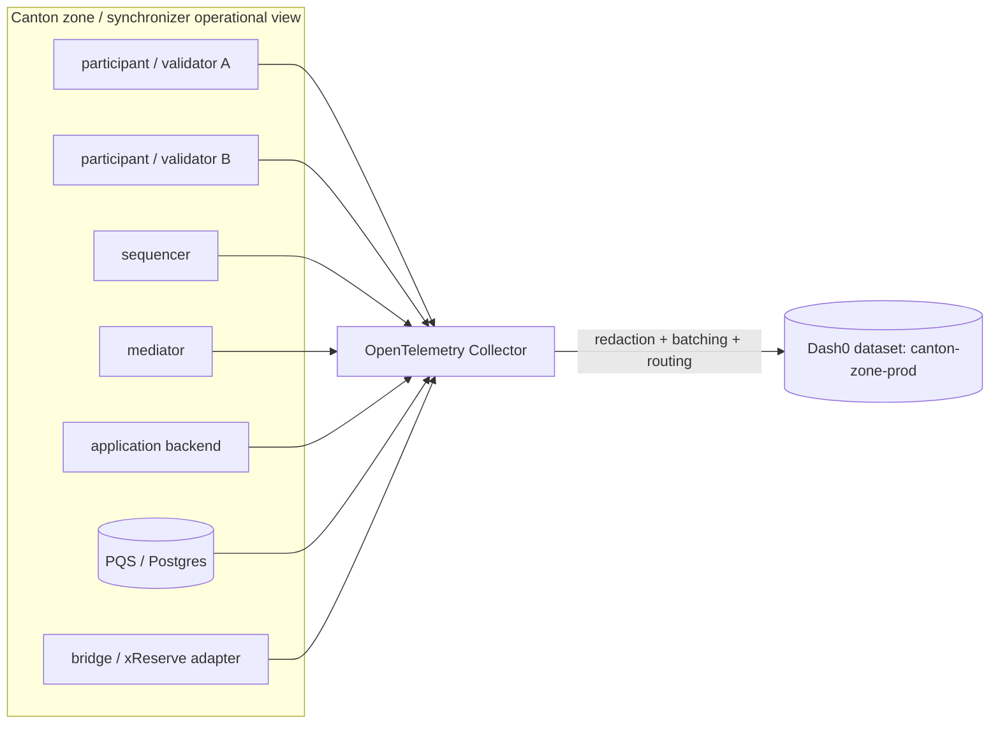
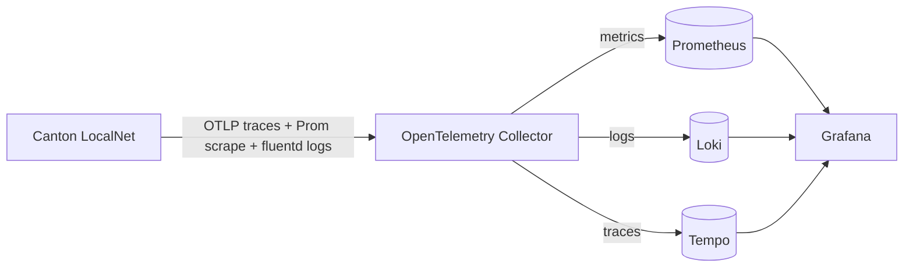
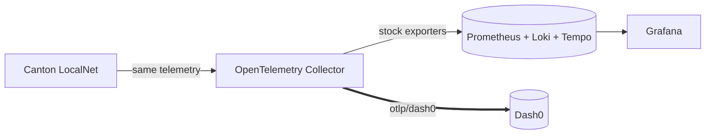
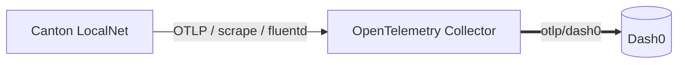
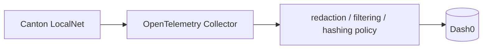
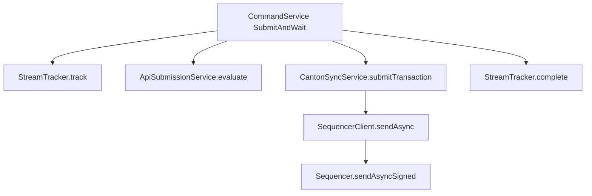
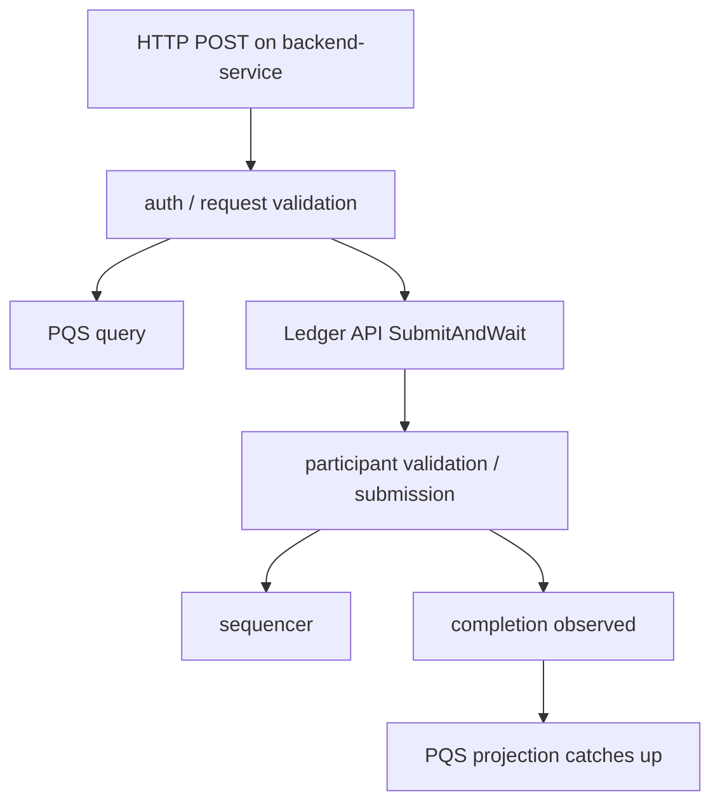
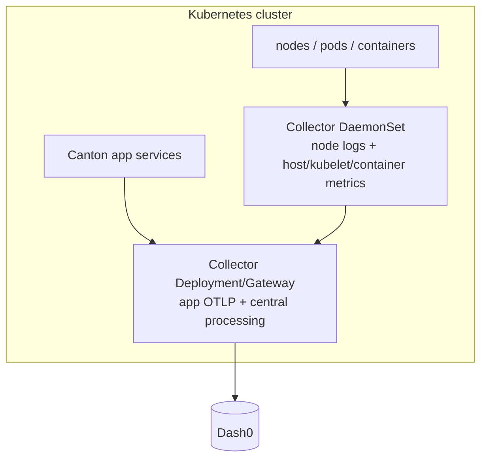

# Canton Network Observability on Dash0

> A runnable demo: migrating Canton Network observability from the stock
> Grafana/LGTM stack to Dash0 by changing only the OpenTelemetry Collector
> exporters. Dual-export keeps the original stack running for side-by-side
> verification, so the backend stays a reversible Collector choice while Canton,
> the Collector receivers, and the processors are left unchanged.

---

## Contents

- [1. Motivation: why this demo](#1-motivation-why-this-demo)
- [2. 90-second pitch](#2-90-second-pitch)
- [3. What I built](#3-what-i-built)
- [4. OpenTelemetry stack](#4-opentelemetry-stack)
- [5. Canton](#5-canton)
- [6. Canton observability stack](#6-canton-observability-stack)
- [7. Dash0](#7-dash0)
- [8. Architecture: before, dual-export, after](#8-architecture-before-dual-export-after)
- [9. Collector implementation details from my project](#9-collector-implementation-details-from-my-project)
- [10. Telemetry details: traces, metrics, logs](#10-telemetry-details-traces-metrics-logs)
- [11. Production hardening discussion](#11-production-hardening-discussion)
- [12. Data residency, privacy, and regulated-customer answer](#12-data-residency-privacy-and-regulated-customer-answer)
- [13. Demo script and commands](#13-demo-script-and-commands)
- [14. Source references](#14-source-references)
- [15. Final closing line](#15-final-closing-line)

---

## 1. Motivation: why this demo

[↑ Back to Contents](#contents)

### 1.1 My honest project motivation

[↑ Back to Contents](#contents)

I chose Canton deliberately, not randomly.

In my previous work integrating **Circle xReserve / USDCx on Canton into the
BoostyLab cross-chain bridge**, we had exactly the kind of operational problem that
Dash0 is trying to solve. Canton is not a simple single-node blockchain system. A
single bridge action can cross an application backend, a Canton participant, a
party, a ledger command, a synchronizer path, cross-chain business logic, and
external Circle/xReserve components.

The painful part was observability. The official Canton quickstart has a useful
Grafana-based observability stack, but in our real mainnet-style environment it was
not installed by DevOps because it was considered heavy and complex to deploy and
operate. The result was that we moved almost blindly: checking scattered logs,
asking whether a party was onboarded, whether a package was available, whether a
ledger command was actually accepted, whether a burn/deposit/withdrawal step was
visible from the right participant, and whether a failure happened in Canton or in
the bridge/xReserve integration layer.

That experience gave me the idea for this demo project:

**Can I take the official Canton observability path and make it easier to consume by
moving the backend from a local Grafana/Loki/Tempo/Prometheus stack to Dash0, while
keeping OpenTelemetry and the existing Collector pipeline?**

### 1.3 What this demo demonstrates

[↑ Back to Contents](#contents)

This project is useful because it demonstrates several things at once:

1. I can connect product positioning to real operational pain.
2. I understand OpenTelemetry as an architecture, not just a logo.
3. I can read and preserve an existing system instead of replacing everything.
4. I can reason about traces, metrics, logs, redaction, cardinality, and production
   deployment.
5. I can identify how a demo becomes a product integration.

---

## 2. 90-second pitch

[↑ Back to Contents](#contents)

I took Digital Asset's `cn-quickstart`, which already ships a real Canton LocalNet
and an observability stack based on the OpenTelemetry Collector, Prometheus, Loki,
Tempo, and Grafana. I switched its observability path to Dash0 without changing
Canton source code and without re-instrumenting the application. The technical point
is simple: Canton already emits useful telemetry into an OpenTelemetry Collector,
so the migration happens at the Collector exporter layer.

In demo mode I run **dual export**. The stock Grafana/LGTM path continues to
receive telemetry, and the same traces, logs, and metrics are exported to Dash0 over
OTLP. That gives a strong proof: I can compare the same Canton transaction behavior
in Grafana and Dash0, with the same telemetry source, and show that the backend is a
reversible choice. Then I switch to a Dash0-only end state, where the Collector keeps
the same receivers and Canton-specific processors, but exports all signals to Dash0
instead of operating separate local telemetry backends.

The reason I chose Canton is strategic and personal. I previously worked on Circle
xReserve / Canton integration in a cross-chain bridge context, where lack of a
proper Canton observability stack made mainnet debugging extremely difficult. Canton
is privacy-preserving and institution-oriented, so observability is not cosmetic.
Operators need to debug distributed transactions across participants, synchronizers,
sequencers, mediators, validators, backend services, PQS projections, and
infrastructure. Dash0's OpenTelemetry-native positioning fits that domain very
cleanly: keep open telemetry and the Collector, but reduce Grafana-stack operational
burden and add unified correlation, PromQL, Perses dashboards, check rules, and
Agent0-assisted troubleshooting.

---

## 3. What I built

[↑ Back to Contents](#contents)

### 3.1 Repository purpose

[↑ Back to Contents](#contents)

This repository is a thin, reversible overlay around Digital Asset's
`cn-quickstart`. It does not fork Canton and does not rewrite the application. It
adds Dash0 as an observability backend by replacing the OpenTelemetry Collector
configuration through a Docker Compose override.

### 3.2 Concrete artifacts

[↑ Back to Contents](#contents)

| Path | Purpose |
|---|---|
| `collector/collector-dual-export.yaml` | Primary demo mode. Keeps Prometheus/Loki/Tempo exporters and adds `otlp/dash0` to all pipelines. |
| `collector/collector-dash0-only.yaml` | End-state mode. Removes Prometheus/Loki/Tempo exporters and sends all signals to Dash0. |
| `collector/collector-dash0-redacted.yaml` | Dash0-only plus edge redaction of sensitive-looking Canton identifiers before egress. |
| `overlay/compose.dash0.yaml` | Docker Compose override for only the `otel-collector` service. Mounts the selected collector file and injects Dash0 environment variables. |
| `Makefile` | Drives `cn-quickstart`, generates `overlay/dash0.env`, patches/unpatches the quickstart Makefile, switches modes, verifies export. |
| `scripts/patch-makefile.sh` | Idempotently inserts a marker-bounded compose override hook into the quickstart Makefile. |
| `scripts/unpatch-makefile.sh` | Removes the hook cleanly. |
| `scripts/verify.sh` | Checks Collector exporter counters and recent export errors. |
| `docs/*.md` | Supporting architecture, migration, tracing, data-residency, and walkthrough notes. |

### 3.3 What is technically interesting

[↑ Back to Contents](#contents)

The interesting part is not that I added another endpoint. The interesting part is
that the project respects the existing system boundary:

```text
Canton telemetry producers: unchanged
Collector receivers:        unchanged
Collector processors:       unchanged
Collector exporters:        changed
Backend destination:         changed
```

This is exactly how an enterprise migration should look: low blast radius,
measurable, reversible, and no application rewrite.

### 3.4 What I verified

[↑ Back to Contents](#contents)

During the live run, the Collector exported real Canton telemetry to Dash0 and to
the stock Grafana stack. I verified increasing Collector exporter counters for
spans, logs, and metric points, with no observed Dash0 export failures during the
run. I also queried Dash0's Prometheus-compatible API to confirm real Canton service
names appeared, including services such as `app-provider`, `app-user`, `sv`,
validators, `scan-app`, `sequencer`, `splice`, `pqs-app-provider`, and
`backend-service`.

### 3.5 What this project is not

[↑ Back to Contents](#contents)

This is important for honesty.

This is not a new Canton instrumentation library. It is not a fork of Canton. It is
not a claim that Dash0 already has a first-class Canton product integration. It is a
migration and product-fit proof using the OpenTelemetry Collector seam that already
exists in `cn-quickstart`.

---

## 4. OpenTelemetry stack

[↑ Back to Contents](#contents)

### 4.1 OpenTelemetry in one paragraph

[↑ Back to Contents](#contents)

OpenTelemetry is the open standard layer for producing, collecting, processing, and
exporting telemetry. It standardizes APIs, SDKs, semantic conventions, propagation,
protocols, and the Collector. Its biggest architectural value is that telemetry is
not hard-wired to one vendor. Applications can emit telemetry using open standards,
and operators can route that telemetry to different backends through the Collector.

### 4.2 The three main telemetry signals

[↑ Back to Contents](#contents)

| Signal | What it answers | Example in Canton |
|---|---|---|
| Traces | Where did this request or transaction go? | A ledger command moves through backend, participant, sequencer, completion. |
| Metrics | How is the system behaving over time? | Command latency, sequencer throughput, exporter failures, CPU/memory, PQS lag. |
| Logs | What exactly happened at a point in time? | Command accepted, contract created, transaction committed, authorization failed. |

Traces explain flow, metrics explain shape, logs explain detail. The value comes
when all three are correlated by service identity, time, trace/span IDs, and
domain identifiers.

### 4.3 OTLP

[↑ Back to Contents](#contents)

OTLP is the native OpenTelemetry Protocol. It can be transported over gRPC or HTTP.
In this project Dash0 export uses OTLP/gRPC from the Collector to Dash0. Inside the
Canton quickstart, traces enter the Collector through OTLP, but metrics and logs do
not all enter as OTLP. Metrics are scraped using the Prometheus receiver, and logs
arrive through the fluentforward receiver from Docker/fluentd logging.

This distinction matters because the honest claim is:

```text
Not:    all signals are OTLP end to end.
Correct: all signals are normalized inside the Collector and exported to Dash0 over OTLP.
```

### 4.4 The Collector mental model

[↑ Back to Contents](#contents)

The Collector is the telemetry control plane at the edge. Its core model is:

```text
receivers → processors → exporters
```

Where:

| Component | Role | Project example |
|---|---|---|
| Receiver | Ingests telemetry from applications or infrastructure. | `otlp`, `prometheus`, `fluentforward`. |
| Processor | Mutates, enriches, filters, batches, samples, or redacts telemetry. | `batch`, `transform/enrich_fluentd_logs`, `transform/enrich_canton_json_logs`, `redaction`. |
| Exporter | Sends telemetry to one or more destinations. | `otlp/tempo`, `otlphttp/loki`, `otlphttp/prometheus`, `otlp/dash0`. |
| Extension | Adds operational capabilities not directly in a pipeline. | health check, pprof, zpages, auth extensions in production. |
| Connector | Connects pipelines by converting one signal to another or routing between pipelines. | Not used in this demo, but useful for span-to-metrics patterns. |

### 4.5 Why the Collector is the migration point

[↑ Back to Contents](#contents)

The Collector separates telemetry production from telemetry consumption.

Without a Collector:

```text
service → vendor-specific exporter → vendor backend
```

With a Collector:

```text
service → open telemetry → Collector → one or more backends
```

That is why my demo is technically strong. I do not ask Canton to know Dash0. I let
Canton continue emitting telemetry to the same Collector, then change only the
exporters.

### 4.6 Receivers in this demo

[↑ Back to Contents](#contents)

#### `otlp` receiver

Used for native OpenTelemetry telemetry. In the project:

```yaml
receivers:
  otlp:
    protocols:
      grpc:
        endpoint: "0.0.0.0:${env:OTLP_LISTEN_PORT}"
```

This is where Canton traces arrive. It is the cleanest signal path because the
data is already OpenTelemetry-native.

#### `prometheus` receiver

Used for scraping Prometheus-format metrics from services and exporters.

In the project it scrapes:

- `otel-collector` self-metrics,
- `cadvisor`,
- `splice`,
- `canton`,
- `nginx-metrics`,
- `postgres-metrics`.

Prometheus compatibility matters because many systems already expose metrics in
Prometheus format. The Collector can scrape those metrics and forward them as
OTLP to Dash0, avoiding a separate Prometheus server as the required final store.

#### `fluentforward` receiver

Used for logs coming through Docker's fluentd logging driver.

This is why I must not claim all logs are emitted by OTel SDKs. In the quickstart,
container logs are forwarded through fluentd into the Collector, then parsed and
enriched before export.

### 4.7 Processors in this demo

[↑ Back to Contents](#contents)

#### `batch`

The batch processor groups telemetry before export. It improves export efficiency
and reduces per-item overhead.

Project example:

```yaml
processors:
  batch:
    timeout: 1s
    send_batch_size: 1024
```

#### `transform/enrich_fluentd_logs`

This processor promotes container names into `service.name`, which is crucial for
service-oriented exploration in Dash0.

Project example:

```yaml
- set(resource.attributes["service.name"],
      Substring(attributes["container_name"], 1, Len(attributes["container_name"]) - 1))
```

#### `transform/enrich_canton_json_logs`

This is a Canton-specific enrichment step. It parses structured Canton JSON logs,
extracts the trace ID, sets the log timestamp, and derives `service.name` from
Canton logger names.

The domain-specific value is in the processors, not in Grafana. I preserved those
processors and changed only the backend destination.

#### `redaction`

The redaction config is a prototype showing how sensitive-looking Canton identifiers
could be masked before telemetry leaves the trust boundary.

Redaction is a pattern, not a compliance guarantee. In production I would first
inspect real telemetry, classify sensitive keys and values, test redaction on
fixtures, and only then make an allow/drop/hash policy.

### 4.8 Exporters in this demo

[↑ Back to Contents](#contents)

#### Stock exporters

The original stack exports to:

```text
otlphttp/prometheus → Prometheus
otlphttp/loki       → Loki
otlp/tempo          → Tempo
```

#### Added Dash0 exporter

```yaml
exporters:
  otlp/dash0:
    endpoint: "${env:DASH0_ENDPOINT}"
    headers:
      Authorization: "Bearer ${env:DASH0_AUTH_TOKEN}"
      Dash0-Dataset: "${env:DASH0_DATASET}"
    retry_on_failure:
      enabled: true
```


- The exporter is the only place where Dash0-specific destination details exist.
- Auth and dataset routing are handled by headers.
- Dash0 receives the processed telemetry after Canton-specific enrichment.

### 4.9 Pipeline comparison

[↑ Back to Contents](#contents)

Stock quickstart:

```yaml
service:
  pipelines:
    traces:  { receivers: [otlp],              processors: [batch], exporters: [otlp/tempo] }
    metrics: { receivers: [otlp, prometheus],  processors: [batch], exporters: [otlphttp/prometheus] }
    logs/1:  { receivers: [otlp],              processors: [batch], exporters: [otlphttp/loki] }
    logs/2:  { receivers: [fluentforward],     processors: [transform..., batch], exporters: [otlphttp/loki] }
```

Dual export:

```yaml
service:
  pipelines:
    traces:  { exporters: [otlp/tempo,          otlp/dash0] }
    metrics: { exporters: [otlphttp/prometheus, otlp/dash0] }
    logs/1:  { exporters: [otlphttp/loki,       otlp/dash0] }
    logs/2:  { exporters: [otlphttp/loki,       otlp/dash0] }
```

Dash0-only:

```yaml
service:
  pipelines:
    traces:  { exporters: [otlp/dash0] }
    metrics: { exporters: [otlp/dash0] }
    logs/1:  { exporters: [otlp/dash0] }
    logs/2:  { exporters: [otlp/dash0] }
```

### 4.10 Collector production topics I should be ready to discuss

[↑ Back to Contents](#contents)

| Topic | Why it matters | Strong answer |
|---|---|---|
| `memory_limiter` | Prevents collector from causing node instability under backpressure. | Add it before `batch` in production pipelines. |
| Sending queue | Absorbs backend/network slowness. | Enable exporter queue and size it based on expected burst/load. |
| Retry policy | Avoids data loss during transient failures. | Use bounded retries; do not hide persistent auth/config errors. |
| TLS/mTLS | Protects telemetry ingress/egress. | Dash0 egress uses TLS; internal OTLP receiver should be secured in production. |
| Secret management | Prevents token leakage. | Use Kubernetes secrets/Vault/secretRef, not `.env`. |
| Sampling | Controls trace volume/cost. | Prefer tail sampling for keeping errors/slow traces and dropping boring success traces. |
| Cardinality | Prevents metric explosion. | Drop/hash high-cardinality labels like party, command, contract when not needed as metric labels. |
| Resource attributes | Prevents service fragmentation. | Normalize `service.name`, `service.namespace`, `deployment.environment`, `service.version`. |
| Collector self-observability | Allows debugging the observability pipeline itself. | Monitor exporter failures, receiver failures, queue capacity, dropped records, memory. |
| Multi-collector topology | Scales collection and isolates responsibilities. | DaemonSet for node-level logs/metrics; deployment/gateway for app OTLP and central processing. |

### 4.11 Agent vs Collector vs SDK wording

[↑ Back to Contents](#contents)

Use this distinction:

- **SDK/instrumentation** lives in the application process and creates spans,
  metrics, and logs.
- **Auto-instrumentation agent** can attach to a runtime, such as Java, and generate
  telemetry without code changes.
- **Collector** is an external pipeline that receives, processes, and exports
  telemetry.
- **Dash0 backend** stores, correlates, queries, visualizes, alerts, and supports
  AI-assisted troubleshooting.

I did not add a Dash0 proprietary agent and I did not re-instrument the Canton
services. I reused the existing OpenTelemetry path and changed the Collector
exporter.

---

## 5. Canton

[↑ Back to Contents](#contents)

### 5.1 Canton in one paragraph

[↑ Back to Contents](#contents)

Canton is a privacy-preserving distributed ledger technology used for multi-party
Daml applications. Unlike public blockchains where every validator typically sees
all state, Canton distributes transaction data only to participants that have the
right to know. That makes it attractive for regulated finance and institutional
workflows, but it also makes observability harder because each participant has a
local view of the ledger rather than a single globally visible transaction stream.

### 5.2 Canton concepts I should know

[↑ Back to Contents](#contents)

| Concept | Meaning | Observability relevance |
|---|---|---|
| Daml | Smart contract / workflow language used to model rights and obligations. | Template IDs, contract IDs, choices, parties show up in business context. |
| Party | On-ledger identity; roughly comparable to an account/address but tied to Daml authorization. | Party IDs are useful pivots but may be sensitive/high-cardinality. |
| Participant / validator | Node that hosts parties, stores visible ledger data, validates affected transactions. | Main place where local ledger state, Ledger API, command submissions, and completions are observed. |
| Synchronizer | Coordinates transaction commits across participants. | Important for cross-party/cross-application flows and latency. |
| Sequencer | Orders and distributes messages between participants. | Backpressure or connectivity problems here can affect many transactions. |
| Mediator | Coordinates confirmation/commit protocol and helps provide atomicity/privacy. | Mediator delay/failure can appear as transaction latency or failed commits. |
| Ledger API | API used by applications to submit commands and read updates. | Entry point for traces and command IDs. |
| PQS / Participant Query Store | Read-model projection of participant-visible ledger data into a database. | Projection lag or stale reads can break applications even if ledger commits succeeded. |
| Splice / Canton Network apps | Reference apps and network infrastructure around Canton Network. | Quickstart includes several services that emit telemetry. |

### 5.3 Canton privacy model and why it matters for observability

[↑ Back to Contents](#contents)

Canton's important difference is **need-to-know visibility**. Participants do not
receive all transaction data. They receive what they are entitled to see based on
the Daml ledger model and contract stakeholders.

Operational implication:

```text
There is no single public-chain-style full transaction view from every node.
Each participant has a local, authorized projection.
```

Observability implication:

```text
Debugging must respect privacy boundaries while still allowing operators to
correlate command IDs, workflow IDs, transaction IDs, ledger offsets, trace IDs,
and service logs.
```

This is exactly why the Collector edge matters. It is the place where we can decide
which attributes are allowed, masked, hashed, dropped, sampled, or routed.

### 5.4 Canton transaction flow at a high level

[↑ Back to Contents](#contents)

Simplified command flow:



The exact internal protocol is more complex, but this diagram is enough for an
this purpose. The point is that one business request crosses many components.

### 5.5 Why Canton was painful in the bridge/xReserve context

[↑ Back to Contents](#contents)

In a bridge context, the operational questions are not trivial:

- Was the user/party properly onboarded?
- Was the expected package/DAR available and vetted on the participant?
- Did the bridge backend submit the ledger command?
- Did the participant accept or reject it?
- Did the transaction commit, and at which local ledger offset?
- Did PQS index the result?
- Is the failure inside Canton, the app backend, Circle/xReserve, or the cross-chain
  execution logic?
- Are we looking from the correct participant/party perspective?

Without traces, correlated logs, and ledger identifiers, each question becomes a
manual investigation. That is the real-world pain behind this demo.

### 5.6 Canton observability identifiers

[↑ Back to Contents](#contents)

| Identifier | Set by | Why it matters |
|---|---|---|
| `ApplicationId` | Ledger client | Which application submitted the command. |
| `WorkflowId` | Ledger client | Business-process correlation. |
| `CommandId` | Ledger client | Business action and retry correlation. |
| `SubmissionId` | Ledger client / participant path | Individual submission tracking. |
| `TransactionId` / `UpdateId` | Ledger | Committed ledger identity. |
| `LedgerOffset` | Participant | Local ledger position; important because participant views are local. |
| `TraceId` / `SpanId` | OpenTelemetry | Distributed tracing spine. |
| `ContractId` | Daml ledger | Specific contract instance. |
| `TemplateId` | Daml model | Smart-contract type / workflow object. |
| `PartyId` | Canton/Daml identity | Actor/authorization context; useful but sensitive/high-cardinality. |

### 5.7 Canton as an observability test case

[↑ Back to Contents](#contents)

Canton is a very good observability test case because it is not just a web app.
It combines application services, a distributed ledger, privacy-preserving local
views, asynchronous transaction processing, and rich domain identifiers. The
observability problem is both technical and semantic: it is not enough to show a
slow span; the operator needs to know which ledger command, party, workflow,
participant, synchronizer path, and projection were involved.

---

## 6. Canton observability stack

[↑ Back to Contents](#contents)

### 6.1 Stock `cn-quickstart` observability stack

[↑ Back to Contents](#contents)

The official quickstart observability stack is already serious. It includes:

- OpenTelemetry Collector for data collection/management,
- Prometheus for metrics,
- Loki for logs,
- Tempo for traces,
- Grafana as the exploration UI,
- Daml Shell for direct ledger inspection,
- direct Postgres/PQS access for local ledger read-model inspection.

This is the reason my project is credible. I did not invent a fake telemetry source.
I used the official quickstart's observability path and changed the destination.

### 6.2 Stock architecture

[↑ Back to Contents](#contents)



### 6.3 What Grafana/LGTM gives Canton

[↑ Back to Contents](#contents)

The stock stack is useful because it lets developers:

- find logs by command/transaction identifiers,
- open traces in Tempo,
- pivot between spans and logs,
- inspect metrics in Prometheus,
- inspect local ledger state through Daml Shell and PQS,
- debug development with tools similar to production.

The point is not that Grafana is bad. The official stack is useful but operationally
heavy. Dash0 can keep the OTel path and reduce the burden of operating multiple
observability backends.

### 6.4 Why the stack was not used in my previous production-like work

[↑ Back to Contents](#contents)

In the BoostyLab/Circle xReserve Canton integration context, the problem was not
that nobody understood observability was useful. The problem was that standing up
and operating the complete Grafana-style stack was extra operational work:

- more containers/services,
- more ports and networking,
- more storage/retention decisions,
- more dashboards/data-source wiring,
- more credentials/access control,
- more maintenance and upgrades,
- more cognitive load for teams already focused on mainnet integration.

That is why a Dash0-style path is compelling:

```text
Keep OTel Collector and domain enrichment.
Stop operating Prometheus + Loki + Tempo + Grafana as the local backend.
Use Dash0 as managed OTLP-native backend.
```

### 6.5 Canton observability failure modes

[↑ Back to Contents](#contents)

| Failure mode | What the operator sees | Useful telemetry |
|---|---|---|
| Ledger command rejected | API error or missing completion | Trace from backend to Ledger API, command ID, logs around validation. |
| Party not onboarded / wrong party | Authorization or missing data | Party ID, participant service logs, app backend logs. |
| Package/DAR not available/vetted | Command cannot be interpreted/executed | Participant logs, package/template IDs. |
| Sequencer backpressure/connectivity | Slow submissions or timeouts | Sequencer metrics, trace spans, queue/backpressure logs. |
| Mediator/confirmation delay | Long transaction latency | Mediator spans/metrics, confirmation timing. |
| PQS projection lag | Ledger commit exists but app read model does not show it | PQS metrics/logs, ledger offset, database metrics. |
| Backend auth/token issue | HTTP 401/403/500 before ledger command | Backend logs, HTTP spans, Keycloak/OAuth spans/logs. |
| Collector export failure | Dash0/Grafana missing telemetry | Collector self-metrics, exporter failure counters, logs. |
| High-cardinality telemetry | Query/cost problems | Top labels, series count, resource attributes, metric label audit. |

### 6.6 What I would want from Dash0 for Canton observability

[↑ Back to Contents](#contents)

The product opportunity is not just ingest. It is semantic navigation:

```text
slow trace → command ID → ledger transaction → local ledger offset → related logs →
PQS projection → affected participant/synchronizer/service → check rule or dashboard
```

Dash0 can make this easier than a manually wired Grafana stack if Canton attributes
are normalized and made first-class pivots.


### 6.7 Canton zone / synchronizer observability concept

[↑ Back to Contents](#contents)

This can be called **Canton zone observability**. In Canton terms, the
more precise word is usually **synchronizer**: a network boundary where participants
coordinate transactions through sequencing and mediation. The product idea is to
observe one Canton zone as a coherent operational unit, not only as isolated
containers.



What this view should answer:

- Is the zone healthy from the perspective of each participant?
- Are command submissions slow before or after the Ledger API boundary?
- Is the bottleneck in the backend, participant, sequencer, mediator, PQS, or bridge
  adapter?
- Are failures isolated to one party/participant or visible across the zone?
- Are high-cardinality identifiers being controlled before export?
- Which dashboard/check rule should an operator open during an incident?

This positions Dash0 not just as "another place to send spans", but as a
candidate control room for a Canton zone.

---

## 7. Dash0

[↑ Back to Contents](#contents)

### 7.1 Dash0 in one paragraph

[↑ Back to Contents](#contents)

Dash0 is an OpenTelemetry-native observability platform for metrics, logs, traces,
and resources. Its positioning is built around open standards such as
OpenTelemetry, PromQL, and Perses, with product features like dashboards, alerting,
synthetic monitoring, Kubernetes monitoring, and Agent0 for troubleshooting.

### 7.2 Why Dash0 fits this project

[↑ Back to Contents](#contents)

Dash0 fits because the project already has OpenTelemetry at the center. The adoption
path is therefore not:

```text
Rewrite Canton instrumentation for Dash0.
```

It is:

```text
Keep Canton telemetry → keep Collector receivers/processors → export to Dash0.
```

That is exactly the story Dash0 wants for OTel-native adoption.

### 7.3 Dash0 vs stock Grafana stack in this demo

[↑ Back to Contents](#contents)

| Dimension | Stock quickstart | Dash0 path |
|---|---|---|
| Collection | OpenTelemetry Collector | Same Collector |
| Metrics backend | Prometheus | Dash0 via OTLP export |
| Logs backend | Loki | Dash0 via OTLP export |
| Traces backend | Tempo | Dash0 via OTLP export |
| UI | Grafana | Dash0 |
| Dashboards | Grafana dashboards | Perses-based Dash0 dashboards |
| Query style | PromQL / LogQL / TraceQL depending on source | PromQL-oriented Dash0 query/product experience |
| AI/RCA | Not built into stack by default | Agent0 |
| Operational burden | Operate several services | Operate Collector; backend managed by Dash0 |
| Migration risk | Baseline | Dual export allows side-by-side verification |

### 7.4 Dash0 concepts to mention

[↑ Back to Contents](#contents)

| Concept | Why it matters here |
|---|---|
| OTLP ingest | The Collector can export directly to Dash0. |
| Datasets | Useful for environment/team/sensitivity separation. My demo uses `canton-quickstart`. |
| PromQL | Makes metric querying familiar to Prometheus/Grafana users. |
| Perses dashboards | Open dashboard standard; aligns with Dash0's anti-lock-in message. |
| Check rules | Alerting based on telemetry queries; useful for Canton SLOs. |
| Agent0 | AI troubleshooting and asset creation on top of real telemetry. |
| Kubernetes operator | Production path for cluster instrumentation and Collector deployment. |
| OTelBin | Useful tool for visualizing/validating Collector configs; relevant to integration work. |

### 7.5 Positioning Dash0 alongside Grafana

[↑ Back to Contents](#contents)

Grafana is powerful and the Canton quickstart uses it well. The point is not that
Grafana is wrong. The point is operational focus. Many teams do not want to run
Prometheus, Loki, Tempo, Grafana, data-source wiring, retention, upgrades, and
access control themselves if they can keep OpenTelemetry and use a managed,
OTel-native product. Dash0's opportunity is to preserve openness while reducing
operational burden and improving correlation/product experience.

### 7.6 Dash0 product ideas from this demo

[↑ Back to Contents](#contents)

| Product idea | Description |
|---|---|
| Canton integration tile | Collector snippets, Compose/Helm examples, setup guide. |
| Canton semantic profile | Standard names for party, participant, synchronizer, command, transaction, contract, template. |
| Perses dashboards | Participant health, Ledger API latency, PQS lag, sequencer throughput, Collector health. |
| Check-rule templates | Command latency, command success rate, PQS lag, exporter failures, high-cardinality warning. |
| Agent0 playbooks | Domain-aware troubleshooting for Canton failure modes. |
| Redaction pack | Collector config examples for masking or hashing Canton identifiers. |
| Cardinality governance | Dashboards and recommendations for party/contract/workflow label explosion. |
| Trace-to-ledger pivots | Dash0 UI patterns for command/transaction/ledger-offset navigation. |

---

## 8. Architecture: before, dual-export, after

[↑ Back to Contents](#contents)

### 8.1 Before: stock `cn-quickstart` observability

[↑ Back to Contents](#contents)



Important nuance:

- Traces enter via OTLP.
- Metrics are scraped with the Prometheus receiver.
- Logs arrive via fluentforward/fluentd.
- All three are exported from the Collector.

### 8.2 Demo mode: dual export

[↑ Back to Contents](#contents)



Dual export proves:

- Dash0 can consume the real telemetry.
- The old Grafana path still works.
- The migration is reversible.
- No re-instrumentation is needed.
- The same trace identity can be compared across both backends.

### 8.3 End state: Dash0 only

[↑ Back to Contents](#contents)



Local demo command:

```bash
make mode-dash0
make reload
make stop-backends
make verify
```

In production: in local Compose the Prometheus/Loki/Tempo/Grafana containers are
stopped non-destructively. In a production deployment those backend services would be
removed from the deployment definition, keeping only the Collector-to-Dash0 path.

### 8.4 Redacted edge-governance mode

[↑ Back to Contents](#contents)



This mode is relevant for regulated customers. Enable it with:

```bash
make mode-redacted
make reload
```

---

## 9. Collector implementation details from my project

[↑ Back to Contents](#contents)

### 9.1 Why I used a Compose override

[↑ Back to Contents](#contents)

I used a Docker Compose override because it is the smallest non-invasive integration
point:

1. Keep the upstream quickstart clone intact.
2. Mount my chosen collector config beside the stock config.
3. Replace the Collector `--config` argument.
4. Inject Dash0 environment variables.
5. Insert and remove the hook with marker-bounded scripts.

This is how I would approach an enterprise proof of concept: avoid a fork, avoid
broad changes, prove value first, then productionize with a cleaner deployment
mechanism.

### 9.2 Overlay file

[↑ Back to Contents](#contents)

`overlay/compose.dash0.yaml` overrides only the Collector service:

```yaml
services:
  otel-collector:
    volumes:
      - ${DEMO_DIR}/collector/${DASH0_COLLECTOR_FILE}:/etc/otel-collector/config.dash0.yaml:ro
    command:
      - --config=/etc/otel-collector/config.dash0.yaml
      - --feature-gates=receiver.prometheusreceiver.EnableNativeHistograms
    environment:
      DASH0_ENDPOINT: ${DASH0_ENDPOINT}
      DASH0_AUTH_TOKEN: ${DASH0_AUTH_TOKEN}
      DASH0_DATASET: ${DASH0_DATASET}
```

### 9.3 Makefile workflow

[↑ Back to Contents](#contents)

| Command | Meaning |
|---|---|
| `make check-env` | Validate Dash0 endpoint/token/dataset and quickstart path. |
| `make mode-dual` | Select dual-export Collector config. |
| `make mode-dash0` | Select Dash0-only Collector config. |
| `make mode-redacted` | Select Dash0-only plus redaction config. |
| `make up` | Generate env, enable quickstart observability, patch Makefile, start LocalNet. |
| `make reload` | Re-apply selected Collector config without full rebuild. |
| `make stop-backends` | Stop local LGTM containers to demonstrate Dash0-only end state. |
| `make verify` | Inspect Collector self-metrics and recent export errors. |
| `make down` | Stop LocalNet and unpatch quickstart Makefile. |

### 9.4 The migration diff

[↑ Back to Contents](#contents)

```diff
 exporters:
   otlphttp/prometheus: { ... }
   otlphttp/loki:       { ... }
   otlp/tempo:          { ... }
+  otlp/dash0:
+    endpoint: "${env:DASH0_ENDPOINT}"
+    headers:
+      Authorization: "Bearer ${env:DASH0_AUTH_TOKEN}"
+      Dash0-Dataset: "${env:DASH0_DATASET}"
 service:
   pipelines:
-    traces:  { exporters: [otlp/tempo] }
-    metrics: { exporters: [otlphttp/prometheus] }
-    logs/1:  { exporters: [otlphttp/loki] }
-    logs/2:  { exporters: [otlphttp/loki] }
+    traces:  { exporters: [otlp/tempo,          otlp/dash0] }
+    metrics: { exporters: [otlphttp/prometheus, otlp/dash0] }
+    logs/1:  { exporters: [otlphttp/loki,       otlp/dash0] }
+    logs/2:  { exporters: [otlphttp/loki,       otlp/dash0] }
```

Dash0-only removes the stock exporters from the pipeline lists.

### 9.5 Verification logic

[↑ Back to Contents](#contents)

`make verify` checks the Collector's own metrics:

```bash
otelcol_exporter_sent_spans
otelcol_exporter_sent_metric_points
otelcol_exporter_sent_log_records
otelcol_exporter_send_failed_spans
otelcol_exporter_send_failed_metric_points
otelcol_exporter_send_failed_log_records
```

I did not rely only on the Dash0 UI. I checked the Collector's own export
counters, because first I want to prove that the pipeline is sending data.

### 9.6 Debugging path if Dash0 shows no data

[↑ Back to Contents](#contents)

1. Confirm Canton generated telemetry by triggering a transaction.
2. Check `docker ps` for `otel-collector`.
3. Check Collector logs for auth/TLS/permission/export errors.
4. Check Collector self-metrics for sent and failed counts.
5. Confirm `DASH0_ENDPOINT`, `DASH0_AUTH_TOKEN`, and `DASH0_DATASET`.
6. Confirm Dash0 time range and dataset selection.
7. Query Dash0 API directly to separate UI/navigation problems from ingest problems.
8. Temporarily add/debug exporter locally if needed.

---

## 10. Telemetry details: traces, metrics, logs

[↑ Back to Contents](#contents)

### 10.1 Traces

[↑ Back to Contents](#contents)

Canton traces are the most compelling signal because they show a transaction moving
through a distributed system.

Example direct Ledger API flow:



Example backend-routed transaction:



What to show in Dash0:

- span tree,
- slow spans,
- errors,
- service names,
- resource attributes,
- correlated logs,
- trace ID,
- relevant Canton identifiers if present.

### 10.2 Metrics

[↑ Back to Contents](#contents)

Useful Canton metrics categories:

| Category | Example questions |
|---|---|
| Ledger API | What is command submission latency? What is error rate? |
| Participant | Is validation slow? Is local ledger processing healthy? |
| Synchronizer/sequencer | Is sequencing delayed? Are there throughput/backpressure symptoms? |
| Mediator | Is confirmation/commit coordination delayed? |
| PQS/Postgres | Is the projection lagging? Are DB connections saturated? |
| Backend service | What is HTTP RED: rate, errors, duration? |
| Infra/container | CPU, memory, restarts, network, disk. |
| Collector | Are we dropping telemetry? Are exports failing? Is queue capacity high? |

Canton metrics caution:

> Never blindly put `party_id`, `contract_id`, `command_id`, or `transaction_id` as
> metric labels. They are useful trace/log attributes, but dangerous metric labels
> because of cardinality.

### 10.3 Logs

[↑ Back to Contents](#contents)

Logs explain the detailed domain events:

- command submitted,
- command rejected,
- transaction committed,
- completion observed,
- contract indexed,
- backend call accepted/rejected,
- package/template issue,
- party/authorization problem,
- sequencer/mediator/participant errors.

The quickstart already has structured Canton JSON logs. The Collector parses them
and enriches them before export, and this migration preserves that enrichment.

### 10.4 Correlation

[↑ Back to Contents](#contents)

The whole value is correlation:

```text
trace_id/span_id
  + service.name
  + time
  + command_id/workflow_id
  + transaction/update id
  + ledger offset
  + party/template/contract context
  = operational explanation
```

Without this, a bridge team is back to blind debugging.

---

## 11. Production hardening discussion

[↑ Back to Contents](#contents)

### 11.1 Local demo vs production deployment

[↑ Back to Contents](#contents)

The local demo proves the integration seam. Production would require additional
work.

| Area | Demo | Production |
|---|---|---|
| Runtime | Docker Compose | Kubernetes / Helm / IaC |
| Secrets | `.env` | Kubernetes Secret, Vault, secretRef, sealed secrets, or cloud secret manager |
| Collector topology | One container | DaemonSet + deployment/gateway collectors |
| Redaction | Prototype regex | Tested policy based on real samples and data classification |
| Resilience | Basic retry | memory limiter, queue, retry tuning, load balancing |
| Auth/TLS | Dash0 TLS egress | mTLS/internal TLS, cert rotation, least privilege |
| Dashboards | Manual/demo | Perses dashboards-as-code |
| Alerts | Manual/demo | Check rules as code, routed notifications |
| Rollback | `make mode-dual` | Canary dual-export window and IaC rollback |

### 11.2 Collector topology for Kubernetes

[↑ Back to Contents](#contents)

A production Canton deployment on Kubernetes should usually split collection roles:



Why:

- DaemonSet is natural for node-local logs and node metrics.
- Gateway/deployment is natural for app OTLP, central redaction, sampling, routing.
- Central collector can apply consistent policies before export.

### 11.3 Secret handling

[↑ Back to Contents](#contents)

Never share or commit:

- `.env`,
- `overlay/dash0.env`,
- Dash0 auth tokens,
- local credentials,
- screenshots containing tokens.

Production approach:

- store Dash0 token in secret manager,
- mount/inject it into Collector only,
- rotate tokens,
- use least privilege,
- separate datasets/environments,
- avoid screen-sharing secrets.

### 11.4 Redaction and privacy

[↑ Back to Contents](#contents)

Canton identifiers can be sensitive:

- parties can identify organizations or users,
- contract IDs can become investigation pivots,
- transaction/update IDs can reveal business workflows,
- logs can contain business metadata,
- command/workflow IDs may include user-defined strings.

Possible strategies:

| Strategy | Use when |
|---|---|
| Drop attribute | Attribute is not useful for debugging or too sensitive. |
| Mask value | Need structure but not raw value. |
| Hash value | Need correlation without revealing original identifier. |
| Allow-list keys | High-compliance environment. |
| Route sensitive logs locally | Logs are too sensitive for SaaS but metrics/traces can leave. |
| Split datasets | Separate prod/dev, tenant, region, or sensitivity class. |

For regulated Canton operators, the Collector is not only a router. It is the
policy enforcement point for telemetry egress.

### 11.5 Cardinality and cost

[↑ Back to Contents](#contents)

High-cardinality attributes are useful but dangerous.

| Attribute | Good as trace/log attribute? | Good as metric label? | Notes |
|---|---:|---:|---|
| `service.name` | Yes | Yes | Essential. |
| `deployment.environment` | Yes | Yes | Essential. |
| `participant_id` | Yes | Sometimes | Bound set; okay if controlled. |
| `synchronizer_id` | Yes | Sometimes | Bound set; useful for zone view. |
| `party_id` | Yes | Usually no | Sensitive and high-cardinality. |
| `contract_id` | Yes | No | Very high-cardinality. |
| `command_id` | Yes | No | Per action/retry. |
| `transaction_id` | Yes | No | Per transaction. |
| `workflow_id` | Yes | Depends | If low-cardinality business workflow names, maybe; if user-generated, no. |

I would keep high-cardinality identifiers on traces and logs, where they are
needed for investigations, but avoid turning them into metric labels unless the
value set is bounded and intentional.

### 11.6 SLO/check-rule candidates

[↑ Back to Contents](#contents)

| Check | Signal | Example condition |
|---|---|---|
| Ledger command success rate | spans/logs/metrics | Errors above threshold for participant/backend. |
| Command submission latency | span metrics | p95/p99 above service objective. |
| Sequencer send latency | spans/metrics | Sequencer path exceeds threshold. |
| PQS lag | metrics/logs | Projection lag above threshold. |
| Backend HTTP errors | metrics/spans/logs | 5xx or auth failures spike. |
| Collector export failure | Collector metrics | `send_failed_*` > 0 for Dash0 exporter. |
| Collector queue pressure | Collector metrics | queue capacity high. |
| High cardinality growth | metrics metadata/cost | series count growth above baseline. |

---

## 12. Data residency, privacy, and regulated-customer answer

[↑ Back to Contents](#contents)

### 12.1 The likely objection

[↑ Back to Contents](#contents)

For a bank-facing Canton operator, the hardest objection to SaaS observability is
not ingest. It is data handling:

- Which region receives telemetry?
- Are party/contract identifiers sensitive?
- Are logs allowed to leave the trust boundary?
- Can the operator prove what was redacted?
- Can cost be bounded if labels explode?
- Can production and debug data be separated?

### 12.2 My answer

[↑ Back to Contents](#contents)

The answer is edge governance:

```text
Canton → Collector → redaction/filtering/sampling/routing → Dash0 dataset/region
```

The Collector gives the customer a controlled place to enforce policy before data
leaves their infrastructure.

### 12.3 My redaction config is only a prototype

[↑ Back to Contents](#contents)

Current demo pattern:

```yaml
processors:
  redaction:
    allow_all_keys: true
    blocked_values:
      - "[Pp]arty::[0-9a-f]{8,}"
      - "\\b[0-9a-f]{64,}\\b"
    summary: info
```

This proves the pattern, not final compliance. A production implementation needs
sample telemetry review, legal/security requirements, key-based policies, tests,
and a decision about masking versus hashing versus dropping.

### 12.4 Regulated-customer approach

[↑ Back to Contents](#contents)

A regulated Canton operator should not blindly stream all telemetry to a SaaS
backend. The approach is to first classify telemetry fields, define allowed
attributes, decide which identifiers need hashing, test the Collector policy on real
samples, separate datasets by environment/sensitivity, and keep highly sensitive logs
local if required. Dash0 still helps because metrics, traces, and safe metadata can be
centralized while the Collector enforces the boundary.

---

## 13. Demo script and commands

[↑ Back to Contents](#contents)

### 13.1 Pre-demo checklist

[↑ Back to Contents](#contents)

Before the demo:

```bash
# Use JDK 21 for cn-quickstart build
export JAVA_HOME=/usr/lib/jvm/java-21-openjdk-amd64
export PATH="$JAVA_HOME/bin:$PATH"

cd ~/My-Projects/Canton/canton-dash0-observability
make check-env
make mode-dual
make up
make verify
make status
```

Open before the demo:

1. Terminal in `canton-dash0-observability`.
2. Terminal in `cn-quickstart/quickstart`.
3. Grafana at `http://localhost:3030`.
4. Dash0 app, dataset `canton-quickstart`, time range last 15 minutes.
5. `PRESENTATION.md` in an editor.

Security reminder:

```text
Do not screen-share .env or overlay/dash0.env.
Rotate any Dash0 token that was ever included in a shared archive.
```

### 13.2 Five-minute demo path

[↑ Back to Contents](#contents)

Use this if time is short.

1. Show architecture diagram: stock Collector + Grafana stack.
2. Show `collector-dual-export.yaml`: same stock exporters plus `otlp/dash0`.
3. Run `make verify`: exporter counters increasing, failures zero.
4. Open one trace/service/log view in Dash0.
5. Open Grafana if already prepared.
6. Conclusion: receivers/processors stayed the same; backend destination changed.

### 13.3 Fifteen-minute demo path

[↑ Back to Contents](#contents)

Use this for technical depth.

1. Explain real-world problem from Canton/xReserve bridge integration.
2. Explain stock quickstart observability.
3. Show Collector pipeline.
4. Show dual export.
5. Trigger a transaction:

```bash
cd ~/My-Projects/Canton/cn-quickstart/quickstart
make create-app-install-request
```

6. Show trace/log/metric correlation in Dash0.
7. Show Dash0-only mode:

```bash
cd ~/My-Projects/Canton/canton-dash0-observability
make mode-dash0
make reload
make stop-backends
make verify
```

8. Explain rollback:

```bash
make mode-dual
make reload
```

### 13.4 Full-depth transaction trigger

[↑ Back to Contents](#contents)

Use only if the environment is stable and they want backend-routed trace depth.

```bash
cd ~/My-Projects/Canton/cn-quickstart/quickstart

TOKEN=$(curl --resolve keycloak.localhost:8082:127.0.0.1 -s \
  http://keycloak.localhost:8082/realms/AppProvider/protocol/openid-connect/token \
  -d client_id=app-provider-unsafe \
  -d username=app-provider \
  -d password=abc123 \
  -d grant_type=password \
  -d scope=openid \
  | python3 -c 'import sys,json;print(json.load(sys.stdin)["access_token"])')

CID=$(curl -s \
  -H "Authorization: Bearer $TOKEN" \
  http://localhost:8080/app-install-requests \
  | python3 -c 'import sys,json;d=json.load(sys.stdin);print(d[0]["contractId"] if d else "")')

curl -s -X POST "http://localhost:8080/app-install-requests/${CID}:accept?commandId=demo-$(date +%s)" \
  -H "Authorization: Bearer $TOKEN" \
  -H "Content-Type: application/json" \
  -d '{"installMeta":{"data":{"demo":"dash0"}},"meta":{"data":{}}}' \
  -w '\nHTTP %{http_code}\n'
```

### 13.5 Verification commands

[↑ Back to Contents](#contents)

```bash
make verify
make status

docker logs --since 5m otel-collector \
  | grep -iE 'dash0|export|tls|unauthenticated|permission' \
  | tail -20
```

### 13.6 Dash0 query API check

[↑ Back to Contents](#contents)

Use this if the UI is slow or if I need to prove data exists.

```bash
API=https://api.<region>.gcp.dash0.com  # adjust to actual Dash0 API endpoint
curl -s \
  -H "Authorization: Bearer $DASH0_AUTH_TOKEN" \
  -H "Dash0-Dataset: $DASH0_DATASET" \
  --get "$API/api/prometheus/api/v1/query" \
  --data-urlencode 'query=sum by (service_name) (dash0_spans_total)'
```

### 13.7 Clean shutdown

[↑ Back to Contents](#contents)

```bash
cd ~/My-Projects/Canton/canton-dash0-observability
make down
```

Then check:

```bash
cd ~/My-Projects/Canton/cn-quickstart/quickstart
git diff -- Makefile
cat .env.local | grep OBSERVABILITY_ENABLED || true
```

---

## 14. Source references

[↑ Back to Contents](#contents)

External sources that ground the claims in this document.

### Dash0

- Dash0 documentation: OpenTelemetry-native observability for metrics, logs,
  traces, resources, dashboards, alerting, synthetics, and Agent0; built on
  OpenTelemetry, PromQL, and Perses.
  - https://www.dash0.com/docs/dash0
- Dash0 OpenTelemetry Collector integration: Collector setup, Kubernetes deployment
  modes, authorization token secret, and dataset header.
  - https://www.dash0.com/hub/integrations/int_opentelemetry-collector/overview
- Dash0 Kubernetes monitoring: Dash0 operator installs an OpenTelemetry Collector
  and gathers traces, logs, and metrics from workloads.
  - https://www.dash0.com/docs/dash0/monitoring/kubernetes/about-kubernetes
- Dash0 dashboards: Perses-based dashboards for logs, metrics, traces, resources,
  and web events.
  - https://www.dash0.com/docs/dash0/dashboards/about-dashboards
- Dash0 alerting/check rules and Agent0-assisted alert creation.
  - https://www.dash0.com/docs/dash0/monitoring/alerting/alerting
- Dash0 Agent0 key concepts and asset creation.
  - https://www.dash0.com/docs/dash0/ai/agent0/key-concepts
  - https://www.dash0.com/docs/dash0/ai/agent0/asset-creation

### Canton / Digital Asset

- Canton Network quickstart observability and troubleshooting overview: OTel
  Collector, Prometheus, Loki, Tempo, Grafana, Daml Shell, correlation identifiers.
  - https://docs.digitalasset.com/build/3.5/quickstart/observe/observability-troubleshooting-overview.html
- Canton Network overview: validators, synchronizers, need-to-know transaction
  distribution, parties.
  - https://docs.digitalasset.com/integrate/devnet/canton-network-overview/index.html
- Canton Network application key concepts: validator nodes, synchronizer nodes,
  Daml parties, frontends/backends/Daml models.
  - https://docs.digitalasset.com/build/3.4/overview/key_concepts.html
- Canton identities: node/party/synchronizer identifiers and namespaces.
  - https://docs.digitalasset.com/operate/3.4/tutorials/getting_started.html

### OpenTelemetry

- OpenTelemetry Collector overview: vendor-agnostic receive/process/export model.
  - https://opentelemetry.io/docs/collector/
- OpenTelemetry Collector configuration: receivers, processors, exporters,
  connectors, service pipelines, extensions.
  - https://opentelemetry.io/docs/collector/configuration/

---

## 15. Final closing line

[↑ Back to Contents](#contents)

**I chose a domain where observability failure is painful, not theoretical. Canton
showed me that without proper traces, logs, metrics, and ledger correlation, teams
can move almost blindly. My demo shows that Dash0 can take the official
OpenTelemetry-based Canton observability path and make the backend simpler,
reversible, and more productized without changing the Canton application itself.**
