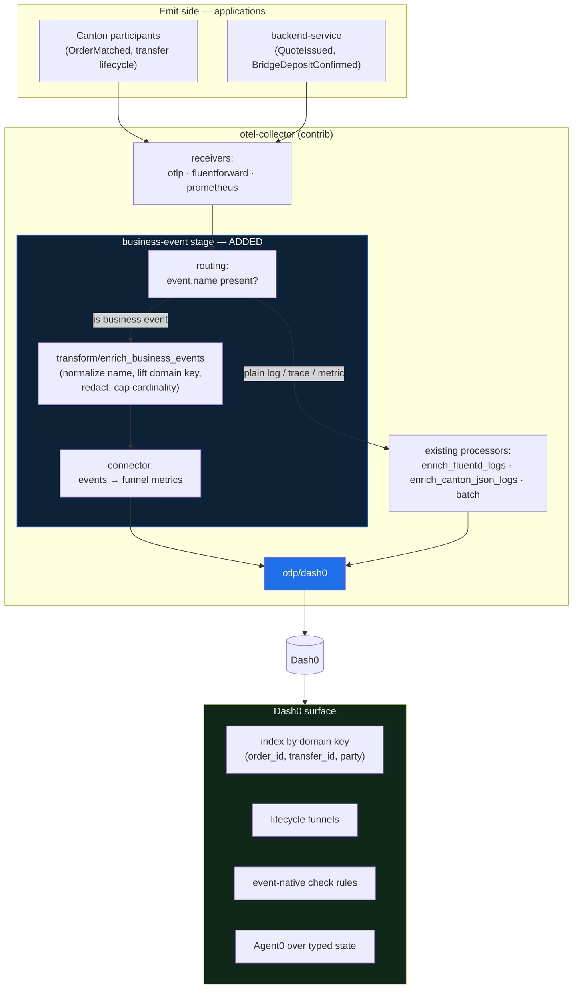
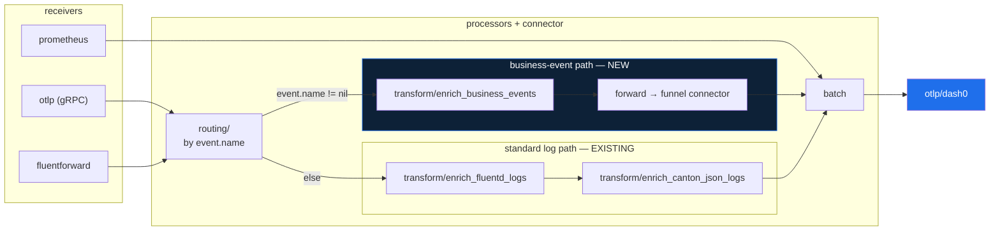
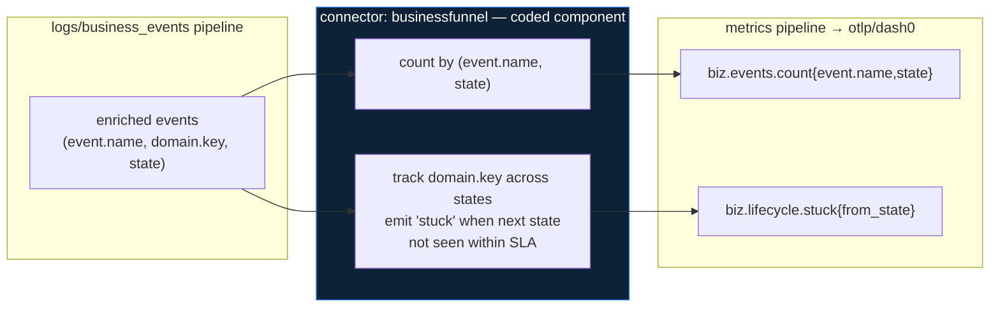
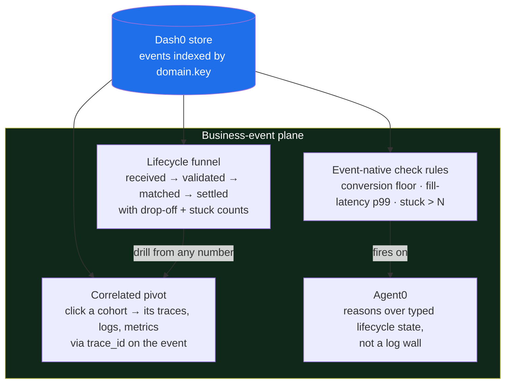
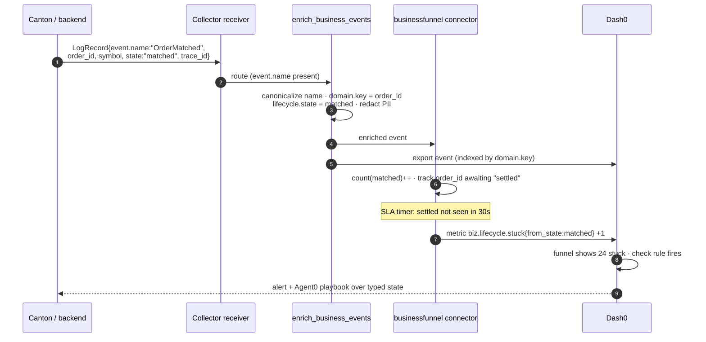

## Contents

- [1. Where the plane sits](#1-where-the-plane-sits)
- [2. The custom collector stage](#2-the-custom-collector-stage)
- [3. Enrichment in detail (OTTL)](#3-enrichment-in-detail-ottl)
- [4. The connector: events → funnel metrics](#4-the-connector-events--funnel-metrics)
- [5. Indexing and rendering in Dash0](#5-indexing-and-rendering-in-dash0)
- [6. One event's lifecycle, end to end](#6-one-events-lifecycle-end-to-end)
- [7. Guardrails at the edge](#7-guardrails-at-the-edge)
- [8. Build order](#8-build-order)

---

## 1. Where the plane sits

The business-event plane is a fourth signal that enters the *same* Collector as the
three existing transports and leaves through the *same* `otlp/dash0` exporter. It does
not replace metrics, logs, or traces; it rides alongside them and correlates by domain
key. The only new pieces are on the emit side (applications produce named
OpenTelemetry Events) and inside the Collector (a dedicated pipeline that recognizes,
normalizes, and enriches those events before export).



The design goal is that the left half (emit) and the transport are unchanged from the
demo, so the plane is reachable by adding the shaded stage and a Dash0-side surface —
consistent with the pitch's claim that "two of the three already exist."

## 2. The custom collector stage

The "custom collector" is the existing contrib Collector with one added routing
decision and one added enrichment processor, wired into a dedicated `logs/business_events`
pipeline. A business event arrives as an OpenTelemetry Event — a `LogRecord` whose
`event.name` attribute is set to a stable name like `OrderMatched` — so the routing
condition is simply "does this log record carry an `event.name`." Records that do are
sent through business-event enrichment; everything else keeps flowing through the
processors already in the repo.




## 3. Enrichment in detail (OTTL)

Enrichment normalizes the event into a shape Dash0 can index by domain key, and it does
so with the same OTTL `transform` processor the repo already uses for Canton JSON logs.
The processor does four things in order: canonicalize `event.name`, lift the
domain-specific id into a single stable `domain.key` attribute, stamp the lifecycle
`state`, and enforce redaction plus cardinality policy before the record leaves the
edge. The sketch below is illustrative OTTL, modeled on the statements in
[collector/collector-dash0-only.yaml:56-68](../collector/collector-dash0-only.yaml#L56-L68).

```yaml
processors:
  transform/enrich_business_events:
    error_mode: ignore
    log_statements:
      - context: log
        conditions:
          - attributes["event.name"] != nil
        statements:
          # 1. canonicalize the event name (trim, case, versioned aliases)
          - set(attributes["event.name"], Trim(attributes["event.name"]))

          # 2. lift the domain-specific id into ONE stable correlation key
          - set(attributes["domain.key"], attributes["order_id"])    where attributes["order_id"]    != nil
          - set(attributes["domain.key"], attributes["transfer_id"]) where attributes["transfer_id"] != nil
          - set(attributes["domain.key"], attributes["transaction_id"]) where attributes["transaction_id"] != nil

          # 3. derive the lifecycle state the funnel groups on
          - set(attributes["lifecycle.state"], attributes["state"]) where attributes["state"] != nil

          # 4. edge policy: redact PII, keep high-cardinality ids OFF metric labels
          - delete_key(attributes, "counterparty_pii")
          - set(attributes["domain.key_present"], attributes["domain.key"] != nil)
```

The reason this stays declarative is that each step is a pure per-record rewrite with no
cross-record memory. Canonicalizing a name, copying one attribute to another, and
deleting a key all operate on the single log record in hand, exactly like the existing
`enrich_canton_json_logs` statements that lift `trace-id` and derive `service.name`.
The moment a requirement needs *two* records — "this deposit has no matching mint" — it
leaves OTTL's reach and becomes the connector of the next section.

## 4. The connector: events → funnel metrics

The funnel counts and the stuck-in-flight detection are stateful joins across events,
so they belong in a connector rather than a transform. A Collector *connector* consumes
from one pipeline and produces into another; here it consumes the enriched
business-event log stream and emits derived **metrics** — one counter per
`(event.name, lifecycle.state)` and a gauge of objects that entered a state but never
reached the next within an SLA window. Those metrics ride the existing metrics pipeline
to Dash0, giving cheap funnel panels and check-rule targets without asking the backend
to scan raw events.



This is the one piece worth building as real code, and it is the honest boundary of the
declarative approach. A stateful connector needs a bounded in-memory (or Redis-backed)
key table keyed by `domain.key`, TTL eviction so the table cannot grow without limit,
and care that the high-cardinality `domain.key` stays on the *event* stream while only
the low-cardinality `(event.name, state, from_state)` tuples become metric labels — the
same cardinality rule [BUSINESS-EVENTS §10](../../../handbooks/infra/observability/dash0/BUSINESS-EVENTS.md)
states for parties and contract ids. For the demo, the OTTL path plus Dash0-side
grouping can stand in; the connector is the production-grade upgrade.

## 5. Indexing and rendering in Dash0

Dash0 is where the enriched stream becomes a plane an operator navigates from. Because
every event now carries a stable `domain.key`, `event.name`, and `lifecycle.state`, the
backend can index by `domain.key` and render three surfaces the stock LGTM stack does
not give you: the lifecycle funnel, the correlated pivot into traces/logs/metrics via
the `trace_id` the event already carries, and event-native check rules on conversion and
latency. The funnel and pivot are reads over the indexed events; the check rules watch
the connector's derived metrics from section 4.



The payoff is the inversion the pitch argues for: the operator starts from "is the
business converting" and treats the traditional three signals as the drill-down, rather
than starting from infrastructure metrics and guessing toward business impact. Each
funnel number is a live cohort — clicking the "24 stuck > 30s" count yields exactly
those `domain.key`s and pivots straight into their traces and logs.

## 6. One event's lifecycle, end to end

The sequence below traces a single order from emission to alert, showing where each
component acts. It makes concrete that the application emits structure once, the
Collector normalizes and derives, and Dash0 renders — no stage re-parses free text.



## 7. Guardrails at the edge

The plane is only credible if it enforces its own limits at the Collector, before
export, and the sketch above places each guardrail deliberately. Redaction and
cardinality policy live in the enrichment transform (section 3) so PII never reaches the
backend and high-cardinality domain ids never land on metric labels. The connector's key
table is bounded with TTL eviction (section 4) so stateful joins cannot leak memory
under a million-order book. And the whole stage is reversible for the same reason the
migration is — every edge is OTLP, so removing the routing branch and the
`logs/business_events` pipeline returns the Collector to its current
[architecture.md](architecture.md) shape with no change to Canton.

- **Emit-side discipline is the real dependency.** The plane is only as good as stable
  `event.name`s and agreed domain keys; without them the enrichment has nothing to lift.
- **Cardinality stays off metrics.** `domain.key` rides events and traces for drill-down;
  only `(event.name, state)` tuples become metric labels in the connector.
- **It is a proposal.** Sections 3–4 are illustrative sketches, not shipped config — the
  shipped repo today enriches Canton JSON logs, not named business events.

## 8. Build order

The path reuses the demo's architecture and adds the stage incrementally, so each step
is demonstrable on its own before the next is built.

1. **Emit** — pick one lifecycle (order book *or* bridge) and have the app emit
   OpenTelemetry Events with a stable `event.name` and a domain-id attribute.
2. **Route + enrich** — add the `routing` decision and `transform/enrich_business_events`
   processor from section 3, wired into a `logs/business_events` pipeline that exports
   through the existing `otlp/dash0`.
3. **Index + funnel in Dash0** — group by `domain.key` and `lifecycle.state`; validate
   the funnel and the correlated pivot on real events.
4. **Connector** — add the stateful `businessfunnel` connector for stuck-in-flight and
   conversion metrics, then attach event-native check rules and an Agent0 playbook.
