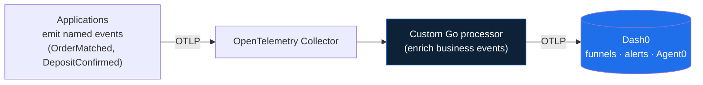
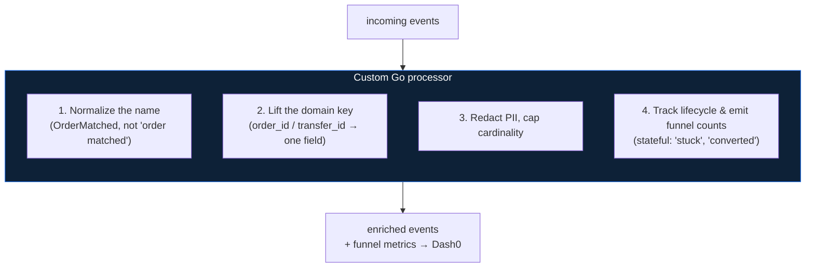
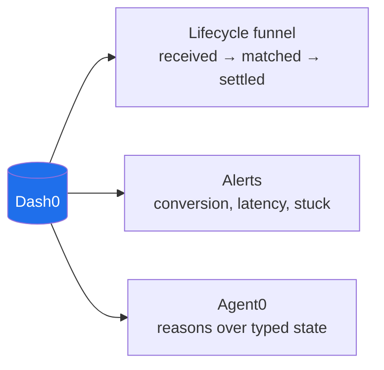

# Implementing the Business-Event Plane on Dash0

This is a high-level sketch of how the [BUSINESS-EVENTS](../../../handbooks/infra/observability/dash0/BUSINESS-EVENTS.md)
idea could be built on this project's pipeline. The short version: business events ride
the *same* OpenTelemetry Collector and the *same* Dash0 exporter the demo already uses,
and the only genuinely new code is a **custom processor written in Go inside the
Collector** that enriches those events before they reach Dash0.

## Contents

- [1. The big picture](#1-the-big-picture)
- [2. What the custom Go processor does](#2-what-the-custom-go-processor-does)
- [3. What Dash0 shows on top](#3-what-dash0-shows-on-top)
- [4. What to build](#4-what-to-build)

---

## 1. The big picture

A business event is just an OpenTelemetry Event — a log record with a stable name like
`OrderMatched` and a few typed fields (order id, state, amount). It travels the pipeline
the demo already has: application → Collector → Dash0. We add one stage in the middle —
a custom processor that recognizes these events and enriches them — and one surface at
the end, in Dash0.

Almost nothing here is new. The applications, the Collector, and the Dash0 exporter all
exist in the demo today (see [architecture.md](architecture.md)). The shaded box is the
one piece we develop.

## 2. What the custom Go processor does

The Collector is written in Go, and its processors are Go components — so the natural
place for business-event logic is a **custom processor** compiled into the Collector.
The demo already does light enrichment with the built-in `transform` processor (parsing
Canton JSON logs); a business-event processor is the same idea, but as real Go code
because the logic is richer and stateful.

Steps 1–3 are simple per-event rewrites. Step 4 is why this is worth writing in Go
rather than doing declaratively: it needs **memory across events**. To know that a
deposit is "stuck," the processor must remember it saw `DepositConfirmed` for an id and
never saw the matching `Minted` within the SLA — a join across records that only code can
do cleanly. That state (a bounded, TTL-evicted table keyed by domain id) is the core of
the custom development.

## 3. What Dash0 shows on top

Once events arrive enriched and indexed by domain key, Dash0 becomes the entry point the
pitch describes: the operator starts from "is the business working," not from
infrastructure metrics.

Each funnel number is a live cohort: click "24 stuck" and you get exactly those objects,
then pivot into their traces and logs via the `trace_id` the event already carries.

## 4. What to build

Only one component is real new development; the rest is configuration and the Dash0-side
surface.

| Piece | Effort | New code? |
|---|---|---|
| Apps emit named events | Naming discipline | No — OTel Events already exist |
| **Custom Go processor** (enrich + track lifecycle) | **The real work** | **Yes — Go, compiled into the Collector** |
| Wire it into the Collector pipeline | Config edit | No |
| Funnels, alerts, Agent0 | Dash0 setup | No |

The custom Go processor is built with the standard **OpenTelemetry Collector Builder**
(`ocb`), which compiles a custom Collector binary that includes your component alongside
the existing receivers and exporters. That keeps the whole thing OTLP end to end and
reversible — removing the processor returns the Collector to its current shape with no
change to Canton.

> This is a proposal, not shipped code. The repo today enriches Canton JSON logs; the
> business-event processor described here is the next step.
